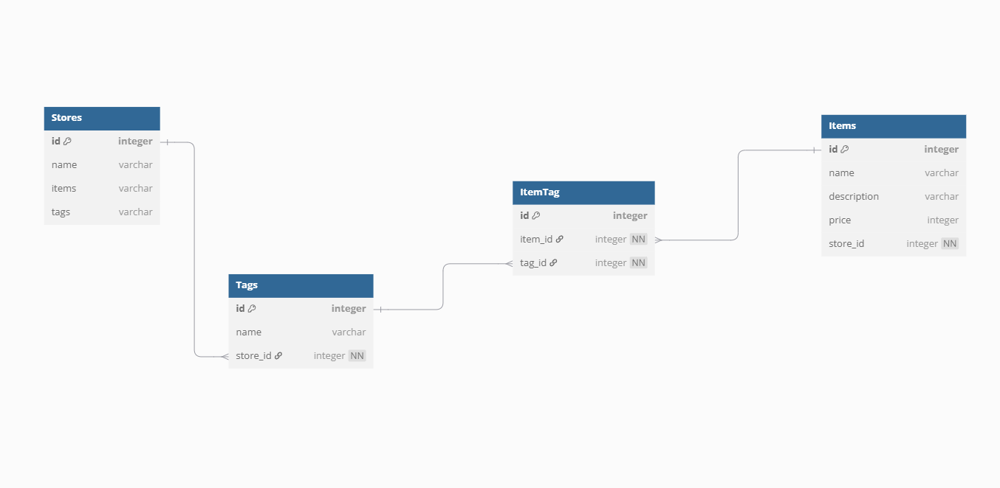
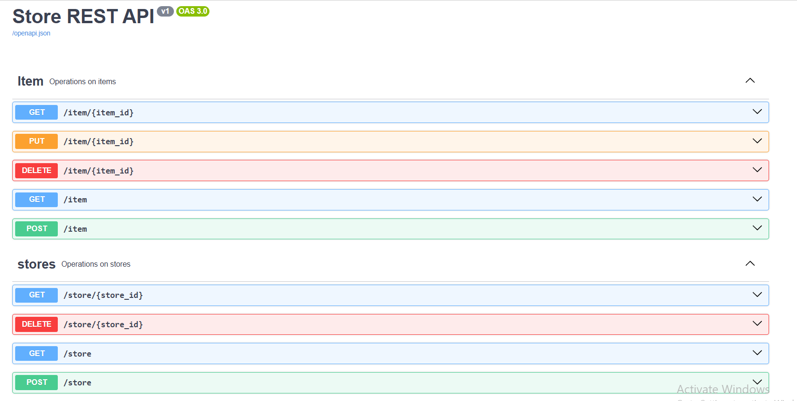

<h1>Rest-api-project</h1>

<table>
  <tr>
    <td></td>
    <td>
      <h3>Ibragimov Muhammad</h3>
       <ul>
         <li>Loyihani python  dasturlashni elementar(junior) biladigan  dastruchilar uchun tavsiya etaman.</li>
         <li>Ushbu loyiha orqali siz <b>Python, Flask</b> va mashhur kengaytmalar yordamida resursga asoslangan, ishlab chiqarishga tayyor <b>REST API</b>-larini yaratishga yo'l-yo'riq beradi. </li>
      </ul> 
    </td>
  </tr>
</table>

### Siz nimani o'rganasiz:

> Salom mening ismim __Muhammad__ va men Python dastrulsh mutaxassisiman. __Rest-api-project__ loyihamda siz foydalanuvchilarni xavfsiz roʻyxatdan oʻtkazish va autentifikatsiya qilish bilan shugʻullanasiz, maʼlumotlar bazasini samarali boshqarish uchun __SQLAlchemy__-dan foydalanasiz va joylashtirishning murakkabliklarini oʻrganasiz. Maʼlumotlar bazasini koʻchirish uchun __Git va Alembic__ kabi muhim texnologiyalarni qamrab olgan holda siz __Python, Flask__ va Docker yordamida veb va __REST API__ ishlab chiqish koʻnikmalaringizni oshirib, mijozlar autentifikatsiyasi va maʼlumotlarni boshqarish uchun __REST API__ ishlab chiqasiz. __SQLAlchemy__ bilan __CRUD__ operatsiyalarini amalga oshirishni, __JWT autentifikatsiyasi__ bilan xavfsiz __API-larni, Flask-JWT-Extended__ yordamida foydalanuvchi __autentifikatsiyasini__ boshqarishni, __Docker va Render.com__ yordamida ilovalarni joylashtirishni, __rq va Mailjet__ yordamida fon vazifalari va elektron pochta xabarlarini boshqarishni o'rganasiz.

### Loyihamizning Umumiy Biznes Logikasi:

>Har bir __do'kon__ bir yoki bir nechta __mahsulotlarni__ saqlaydi va har bir __mahsulot teglar__ bilan bog'lanishi mumkin. Bu bog'lanishlar xaridorlarga mahsulotlarni qidirishda va tanlashda yordam beradi.

<ol>
    <li> <b>Store (Do'kon)</b>
        <ul>
            <li>Har bir do'kon o'z mahsulotlarini <b>(items)</b> saqlaydi.</li>
            <li>Do'konlar o'rtasida mahsulotlar almashinuvi yoki bir xil mahsulotlar bo'lishi mumkin.</li>
            <li>Do'konlar o'zlarining xaridorlariga xizmat ko'rsatadi va mahsulotlar orqali daromad olishadi.</li>
        </ul>
    </li>
    <li> <b>Item (Mahsulot)</b>
        <ul>
            <li>Mahsulotlar do'konlar ichida joylashgan va har bir mahsulot o'z narxi va tavsifi bilan xaridorlarga taqdim etiladi.</li>
            <li>Mahsulotlar do'konlar o'rtasida farq qiladi, ya'ni bir do'konda mavjud bo'lgan mahsulot boshqa do'konda bo'lmasligi mumkin.</li>
            <li>Mahsulotlar xaridorlar tomonidan sotib olinadi va bu do'konning daromadini oshiradi.</li>
        </ul>
    </li>
    <li> <b>Tag (Teg)</b>
        <ul>
             <li>Teglar mahsulotlarga qo'shiladi va ularni turli kategoriyalarga ajratadi (masalan, "ofis", "texnika", "mebel").</li>   
             <li>Teglar yordamida xaridorlar o'zlariga kerakli mahsulotlarni tezda topishlari mumkin.</li>   
             <li>Teglar do'konlar o'rtasida bir xil bo'lishi mumkin, lekin har bir do'konda o'ziga xos teglar ham bo'lishi mumkin.</li>   
        </ul>
    </li>
</ol>

### Loyihamizning SQL Struktura::

[Ushbu silka orqali ko'rishingiz mumkin](https://dbdiagram.io/d/67d6e95075d75cc844425869)

### Bu loyihamiz orqali biz quydagi kutobxonalr nima uchun kerak va undan foydalnish yo'llarini o'rganamiz
<table>
  <tr>
    <td>1. <b>Flask</b></td>
    <td>8. <b>Flask-migrate</b></td>
  </tr>
  <tr>
    <td>2. <b>Flask-smorest</b></td>
    <td>9. <b>Gunicorn</b> </td>
  </tr>
  <tr>
    <td>3. <b>Python-dotenv</b></td>
    <td>10. <b>Psycopg2</b> </td>
  </tr>
  <tr>
    <td>4. <b>Sqlalchemy</b></td>
    <td>11. <b>Requests</b> </td>
  </tr>
  <tr>
    <td>4. <b>Flask-sqlalchemy</b></td>
    <td>12. <b>Mailjet_rest</b> </td>
  </tr>
  <tr>
    <td>5. <b>Passlib</b></td>
    <td>13.  <b>rq</b></td>
  </tr>
  <tr>
    <td>6. <b>Flask-jwt-extended</b></td>
    <td></td>
  </tr>
</table>

### Loyihamizga docker va docker-compose fayllarini qo'shamiz.

> __Docker va Docker-compose__ fayllari yordamida __windows, linux va unix__ operatsion tizimlarida loyihamizni bita buyruq yordamida ishga tushurishni o'rganamiz

### Github bilan ishlashda quydagi git buyruqlarini o'rganamiz:
<table>
  <tr>
    <td>1. <b>git init</b></td>
    <td>7. <b>git pull</b></td>
  </tr>
  <tr>
    <td>2. <b>git clone ...</b></td>
    <td>8.  <b>git merge</b> </td>
  </tr>
  <tr>
    <td>3. <b>git status</b> </td>
    <td>9. <b>git stash</b> </td>
  </tr>
  <tr>
    <td>4. <b>git stash list</b></td>
    <td>10. <b>git apply</b></td>
  </tr>
  <tr>
    <td>5. <b>git commit -m"..."</b></td>
    <td>11. <b>git branch</b> </td>
  </tr>
  <tr>
    <td>6. <b>git push</b> </td>
    <td>12. <b>git checkout</b></td>
  </tr>
</table>

- [Loyihamizning github dagi mazili](https://github.com/PacktPublishing/REST-APIs-with-Flask-and-Python-in-2023)

### Atrof muxit o'zgaruvchilarni boshqarishni o'rganamiz:
> __.env__ faylini qanday ishlatishni o'rganamiz

### Mailjet bilan integratsiya qilamiz
> Foydalanuvchilar pochtasiga habar yuboramiz: [Mailjet](https://www.mailjet.com/) orqali

### Loyihaga Swagger-ui hujjatlarini qo'shishni ko'rib chiqamiz:

[Swagger-ui](https://test-uchun.uz/swagger-ui)

### API endPoit lari uchun  response va require uchun validatsiyalr yozamiz:

> __@blue.arguments()__ va  __@blue.response()__ dekoratorlari va __Schema(Sxema)__ tushunchasini qo'llashni o'rganamiz 

### Loyihamiz uchun Unittest yozamiz:

>__API__ lar uchun unit testlar, __API__ lar orqali bajariladigan funksiyalarni alohida tekshirishga mo'ljallangan testlardir. Bu testlar __API__ ning har bir __endpoint__ ini, uning kirish va chiqish parametrlarini, va kutilgan natijalarni tekshirishda yordam beradi.

### Render.com sayti bilan tanishamiz:

> [render.com](https://render.com/) Bu sayt orqali loyihamizni serverga yuklaymiz.

### Eng so'ngida miskroservislar bilan tanishamiz
> __Mikroservislar__ — bu dasturiy ta'minotni arxitektura uslubi bo'lib, u katta va murakkab tizimlarni kichik, mustaqil va o'zaro bog'liq xizmatlarga bo'lishni nazarda tutadi. Har bir __mikroservis__ o'z vazifalarini bajaradi va o'zining alohida kod bazasiga, ma'lumotlar bazasiga va joylashuviga ega bo'lishi mumkin.